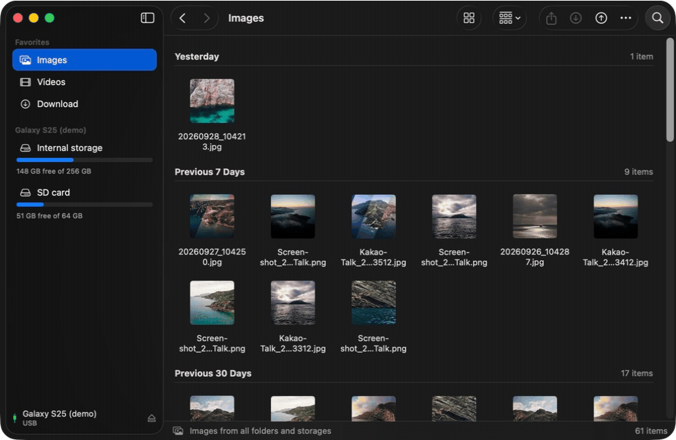

<p align="center">
  
</p>

<h1 align="center">DroidDock</h1>

<p align="center">
  A native, Finder-style Mac app for browsing an Android phone over USB and copying files both ways.<br>
  <a href="https://github.com/abehan7/droiddock/releases/latest"><b>Download the DMG</b></a> ·
  <a href="https://abehan7.github.io/droiddock/">Documentation</a>
</p>

<p align="center">
  
</p>

Plug in your phone and DroidDock opens it like a Finder window: Icons, List, Columns and Gallery
views with real photo thumbnails, drag and drop, Back/Forward, Get Info, New Folder and Delete.
It talks to the phone over **MTP** ("File transfer" mode, through [libmtp](https://github.com/libmtp/libmtp))
or, when USB debugging is on, over **adb**, which lists big folders much faster.

## Screenshots

| Icons, with every photo in one place | List |
| --- | --- |
|  |  |
| **Columns** | **Gallery** |
|  |  |

<p align="center">
  
</p>

All screenshots use the built-in demo phone (`--args -demo`).

## Download

Grab **`DroidDock-<version>.dmg`** from the [latest release](https://github.com/abehan7/droiddock/releases/latest),
open it and drag **DroidDock** into **Applications**.

**Requirements:** a Mac with Apple silicon (M1 or later), macOS 26 Tahoe or later. Built and tested
with Samsung Galaxy phones; other Android phones usually work too via **Connect with USB**.

### First launch

The app is open source and not notarized by Apple, so macOS stops it the first time:

1. Open DroidDock once; macOS says it can't verify the developer. Click **Done**.
2. Open **System Settings → Privacy & Security**, scroll down and click **Open Anyway** next to DroidDock.
3. Confirm with **Open Anyway** and your password. From then on it opens normally.

Or, in Terminal: `xattr -dr com.apple.quarantine /Applications/DroidDock.app`

## Connecting a phone

1. Unlock the phone and plug it in.
2. Tap the USB notification and choose **File transfer**.
3. Quit anything else that grabs the phone: Smart Switch, Android File Transfer, OpenMTP, MacDroid,
   Image Capture and Photos. Only one program can hold the phone at a time.

DroidDock connects on its own when a Samsung phone is plugged in; otherwise click **USB** in the toolbar.
For faster browsing, turn on **Developer options → USB debugging** on the phone and install
`adb` (`brew install --cask android-platform-tools`); DroidDock then uses adb automatically.

## Features

- **Favorites** in the sidebar: **Images** and **Videos** gather every photo and video from
  DCIM/Camera, Screenshots, Screen recordings, Pictures and Movies across all storages;
  **Download** jumps to the phone's Download folder
- **View** as Icons / List / Columns / Gallery (⌘1–⌘4), with thumbnails from the phone
- **Group** by Kind / Date Modified / Size, **sort** by Name / Kind / Date / Size
- **Download**, **Upload**, drag and drop in both directions, and **Share** through the macOS share sheet
- **Search** the current folder, Back/Forward (⌘[ ⌘]), Enclosing Folder (⌘↑)
- Double-click to open a file on the Mac, ⌘I Get Info, ⇧⌘N New Folder, ⌘⌫ Delete

Try it without a phone: `open /Applications/DroidDock.app --args -demo` shows a fake Galaxy
with folders and generated photos. Browsing works; transfers are refused.

## Build from source

```bash
brew install libmtp xcodegen
xcodegen generate          # project.yml -> DroidDock.xcodeproj
open DroidDock.xcodeproj   # ⌘R
```

- **Debug** loads libmtp from `/opt/homebrew`.
- **Release** runs `scripts/embed-dylibs.sh`, which copies libmtp + libusb into
  `Contents/Frameworks` and rewrites their load paths to `@rpath`, so the app runs without Homebrew.

```bash
scripts/make-dmg.sh        # Release build -> dist/DroidDock-<version>.dmg
```

More in the [build guide](docs/building.md). Debug libmtp traffic with the env var `LIBMTP_DEBUG=9`.

## Code layout

| File | Role |
| --- | --- |
| `PhoneEngine.swift` | The protocol both connection types implement |
| `MTPEngine.swift` | Every libmtp call, on one serial queue |
| `ADBEngine.swift`, `ADB.swift` | The adb connection: folder listings, transfers, thumbnails |
| `BrowserModel.swift` | `@MainActor` app state: connection, folder, selection, transfers |
| `USBWatcher.swift` | IOKit plug/unplug notifications for Samsung (`0x04E8`) |
| `ContentView.swift` | Window, sidebar, Finder-style toolbar, item menu, path and transfer bars |
| `BrowserViews.swift` | Icons, List, Columns and Gallery views; thumbnails and previews |
| `WiFiConnectView.swift` | Wireless-debugging pairing (built, currently hidden) |
| `DemoPhone.swift` | Fake phone for `-demo` |
| `DroidDockApp.swift` | Entry point and menus; releases the phone on quit |

## License

DroidDock is [MIT-licensed](LICENSE). The release build bundles libmtp and libusb, which are
LGPL-2.1 and dynamically linked; see [THIRD_PARTY_NOTICES.md](THIRD_PARTY_NOTICES.md).
