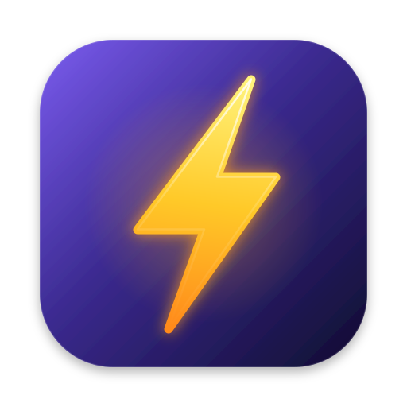
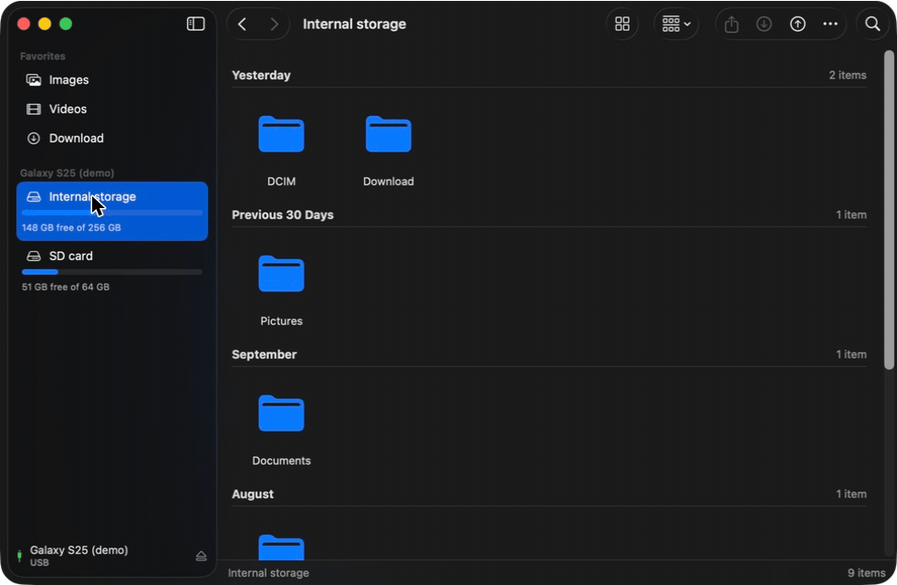
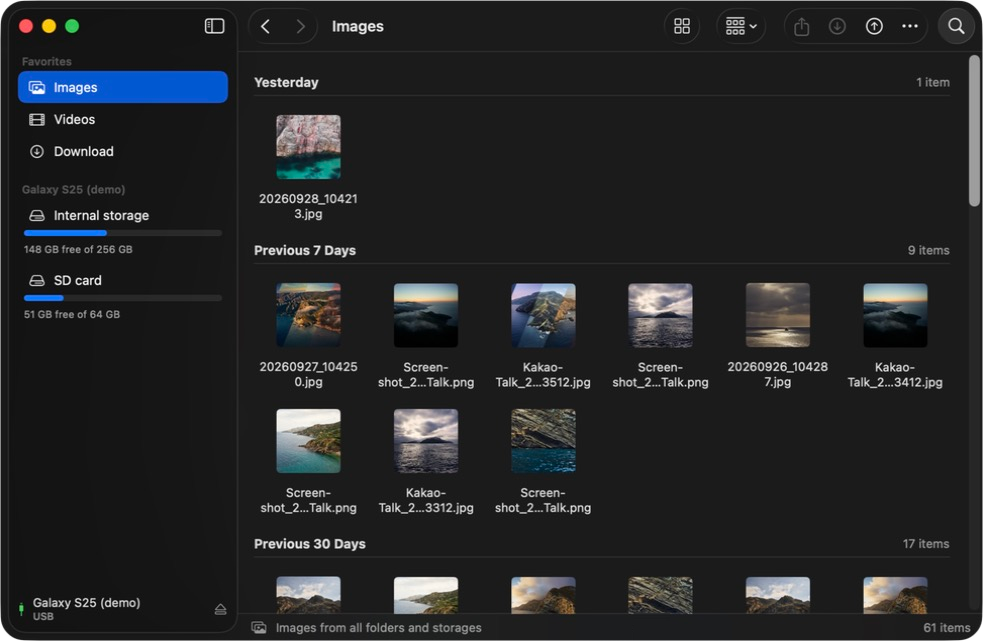
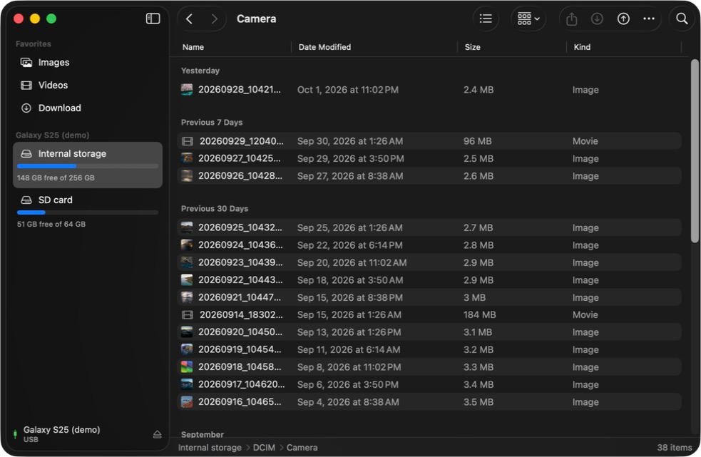
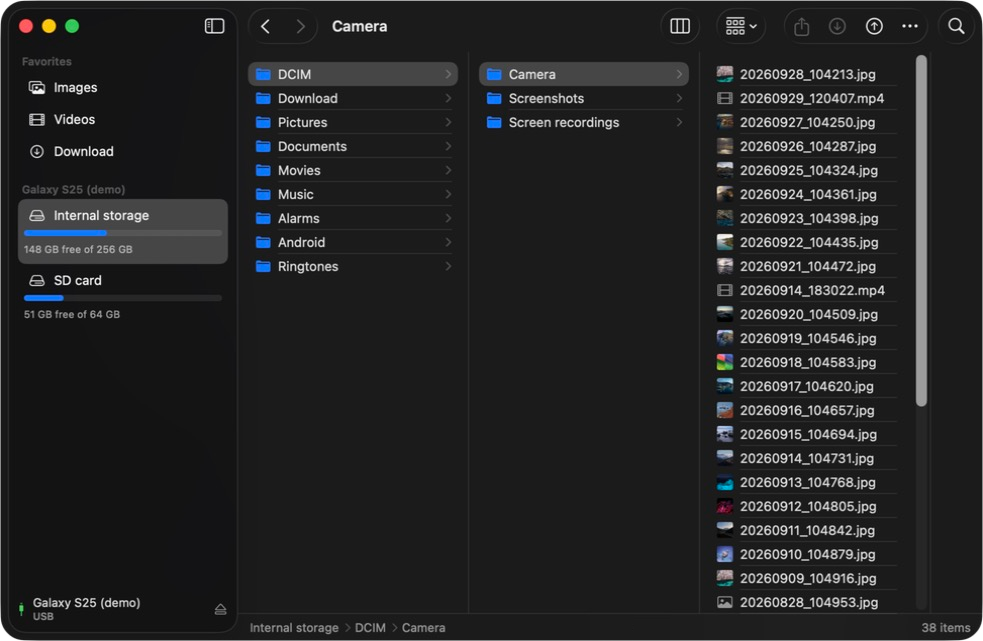
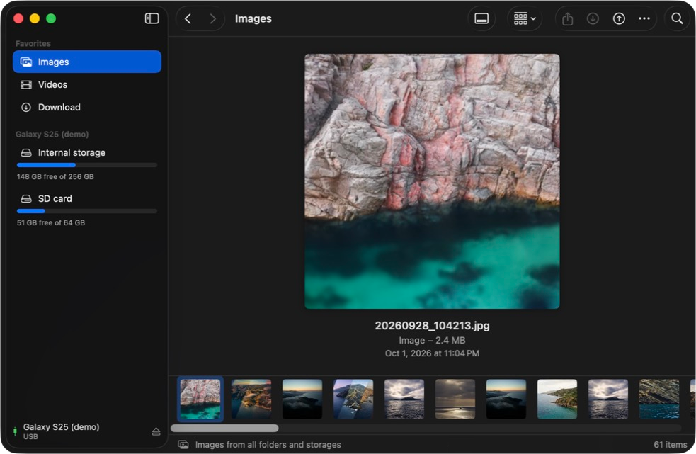

DroidDock opens your Android phone on your Mac like a Finder window. Plug it in over USB, then browse,
preview, download and upload files with the views and shortcuts you already know.

**[⬇ Download the latest DMG](https://github.com/abehan7/droiddock/releases/latest)**
· Apple silicon Mac · macOS 26 or later · free and [open source](https://github.com/abehan7/droiddock)

## Guides

- **[Install](install.md)**: download, drag to Applications, get past the first-launch warning
- **[Using DroidDock](guide.md)**: connecting a phone, views, transfers, shortcuts, troubleshooting
- **[Building from source](building.md)**: Xcode project, bundled libraries, making the DMG

## Why another Android file app?

Android File Transfer is gone, and most alternatives are slow, subscription-based or feel
nothing like a Mac. DroidDock is a native SwiftUI app:

- **Finder-style**: Icons, List, Columns and Gallery views, sidebar Favorites, Back/Forward, Get Info
- **Photos first**: **Images** and **Videos** gather every camera shot, screenshot and recording into one place, with thumbnails
- **Two ways in**: MTP ("File transfer" mode) works on any phone; with USB debugging on it switches to adb, which lists huge folders in about a second
- **No Homebrew needed**: the DMG bundles everything it uses

## Screenshots

| Icons | List |
| --- | --- |
|  |  |
| **Columns** | **Gallery** |
|  |  |

Screenshots use the built-in demo phone: `open /Applications/DroidDock.app --args -demo`.
